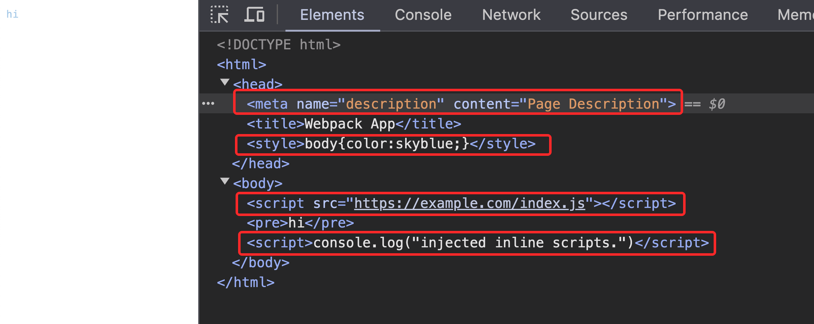

# unplugin-inject-html-tags

Inject custom html tags to html content, works with vite & webpack 5.

## Install

```bash
npm i -D unplugin-inject-html-tags
```

## Usage

<details>
<summary>Vite</summary>

```ts
// vite.config.ts
import unpluginInjectHtmlTags from 'unplugin-inject-html-tags/vite'

export default defineConfig({
  plugins: [
    unpluginInjectHtmlTags({
      tags: [
        { tag: 'script', attrs: { src: 'https://example.com/index.js' }, injectTo: 'body-prepend' },
        { tag: 'script', children: 'console.log("injected inline scripts.")', injectTo: 'body' },
        { tag: 'meta', attrs: { name: 'description', content: 'Page Description' }, injectTo: 'head-prepend' },
        { tag: 'style', children: 'body{color:skyblue;}', injectTo: 'head' },
      ]
    }),
  ],
})
```

Example: [`playground/`](./playground/vite/)

</details>

<details>
<summary>Webpack</summary>

```ts
// webpack.config.js
import unpluginInjectHtmlTags from 'unplugin-inject-html-tags/webpack'

module.exports = {
  plugins: [
    unpluginInjectHtmlTags({
      tags: [
        { tag: 'script', attrs: { src: 'https://example.com/index.js' }, injectTo: 'body-prepend' },
        { tag: 'script', children: 'console.log("injected inline scripts.")', injectTo: 'body' },
        { tag: 'meta', attrs: { name: 'description', content: 'Page Description' }, injectTo: 'head-prepend' },
        { tag: 'style', children: 'body{color:skyblue;}', injectTo: 'head' },
      ]
    })
  ]
}
```

Example: [`playground/`](./playground/webpack/)

</details>

<details>
<summary>Vue CLI</summary>

```ts
// vue.config.js
import unpluginInjectHtmlTags from 'unplugin-template/webpack'

module.exports = {
  configureWebpack: {
    plugins: [
      unpluginInjectHtmlTags({
        tags: [
          { tag: 'script', attrs: { src: 'https://example.com/index.js' }, injectTo: 'body-prepend' },
          { tag: 'script', children: 'console.log("injected inline scripts.")', injectTo: 'body' },
          { tag: 'meta', attrs: { name: 'description', content: 'Page Description' }, injectTo: 'head-prepend' },
          { tag: 'style', children: 'body{color:skyblue;}', injectTo: 'head' },
        ]
      }),
    ],
  },
}
```

</details>

## Preview

<div align="center">
  
</div>

## Options

- `tags`: [`HtmlTagDescriptor[]`](https://vitejs.dev/guide/api-plugin.html#transformindexhtml)

## Thanks

- [unplugin-inject-preload](https://github.com/Applelo/unplugin-inject-preload) - mostly inspired by it.
